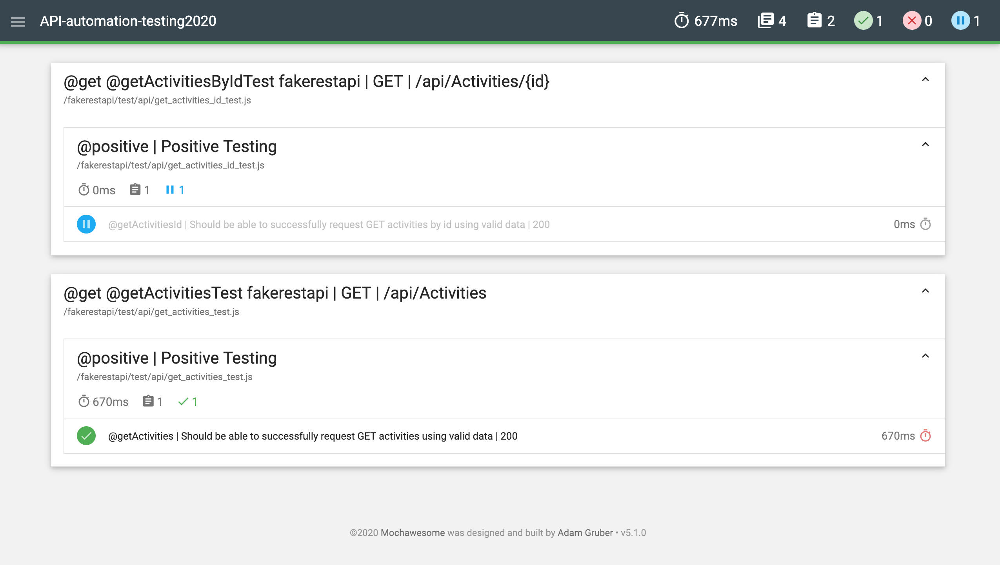
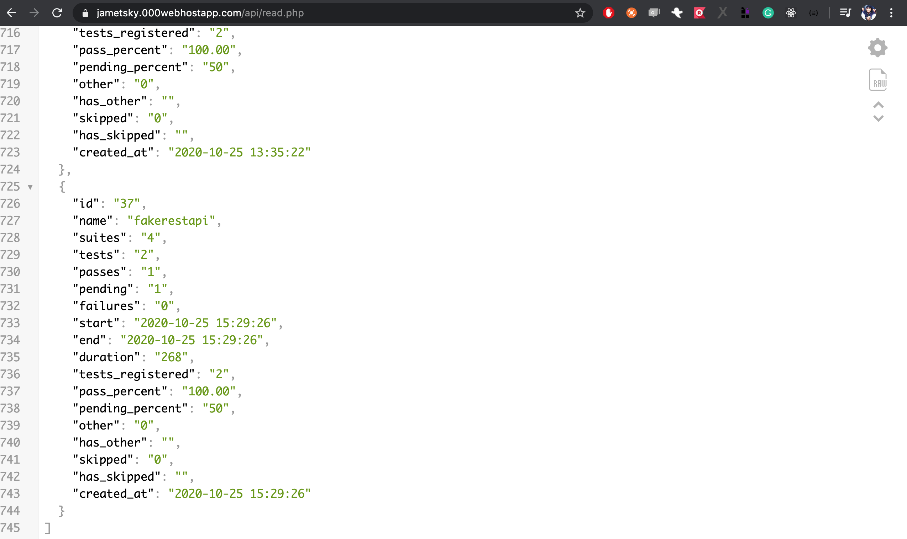
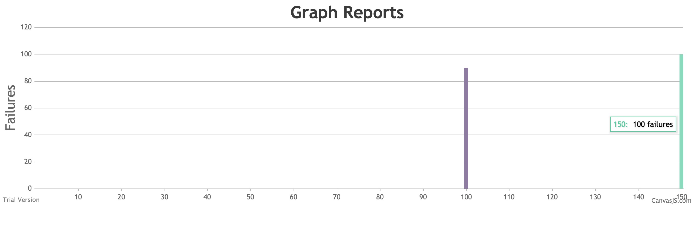

 

# Boilerplate on API Automation Testing

### Mocha
> Mocha termasuk framework pengujian yang bisa dipakai secara BDD ataupun TDD. Framework ini secara default memakai style BDD. Metode umum BDD adalah seperti describe, it, before, after, dsb... (http://idjs.github.io/belajar-nodejs/testing/mocha.html)

### Chai
> Chai library yang digunakan untuk melakukan pengujian/validasi/assertion pada setiap response API. (https://medium.com/@albertkurnia/api-testing-dengan-mocha-chai-6543ff03010b)

### SuperTest
> SuperTest yaitu module yang khusus untuk menguji/komunikasi dengan server melalui HTTP request. (https://idjs.github.io/belajar-nodejs/testing/rest_testing.html)

### Prerequisites

- Install Node.js and npm, we will use npm to install Mocha & Chai and SuperTest

### Tested on
- MacOS Catalina version `10.15.7` - 2020
- node version `^v12.14.1` - 2020
- npm version `^6.14.5` - 2020 

### How to Getting Started

```sh
$ cd [project]
$ npm install or yarn install
$ cp .env.sample .env
```

### This is directory structure

    .
    ├── [SERVICE]
    |        ├── data/
    |        ├── page/
    |        └── test/   
    ├── helper
    |        ├── seed/
    |        |      ├── query/ 
    |        |      └── execute_sql.js 
    |        └── response_status.json      
    ├── reports 
    |        ├── [SERVICE]
    |        |        └── mochawesome/
    |        └── ... 
    ├── .env
    └── package.json

| Directory | Description                                                       |
| --------- | ----------------------------------------------------------------- |
| data      | For test data, file extention should be .json                     |
| page      | 1 endpoint, many HTTP method in one file .js                      |
| test      | 1 endpoint, 1 HTTP method, many test cases. or e2e                |
| helper    | Common code, for general needed such as response_code, token, etc |
| reports   | Results test with mochawesome reporter (html & json)              |

### Foldering and Naming Convention

1. Filename using `snake_case`
2. Variable name using `camelCase`
3. The file (.js and .json) should be located in a path that matches the endpoint path
4. Variable Env name using `UPPER_CASE`

```sh
GET {{BASE_URL}}/authors/books
--data: /data/authors/book_data.json
--page: /page/authors/books.js
--test: /test/authors/get_books_test.js
```

## Dummy Sample REST API
- Swagger Fakerestapi http://fakerestapi.azurewebsites.net/swagger/ui/index

## Run the test

You can specify the command that you want to run from package.json file.

###### Here are our default commands

```sh
$ npm run test-[SERVICE]                                | to run all tests
$ npm run test-[SERVICE] -- --grep @tag                 | to run test with specific tag
$ npm run test-[SERVICE] -- --grep @skip --invert       | to exclude @skip tag

$ npm run reports-[SERVICE]                             | to open the mochawesome report
```

## Integration test on CI

You can go to github `Actions`.

## Reporter

You can go to https://jametsky.000webhostapp.com/


go to https://jametsky.000webhostapp.com/api/read.php


go to https://jametsky.000webhostapp.com/chart/
